# BRIKA — DEFINITIVE ERD V1

## 1. Objetivo

Este documento define el **modelo entidad-relación conceptual definitivo de Brika V1**.

El ERD es la fuente de verdad para el diseño físico de PostgreSQL (`16_POSTGRESQL_SCHEMA_SPECIFICATION.md`). Ambos documentos deben coincidir; cualquier entidad de este ERD debe tener tabla física, y viceversa.

Principios:
- SaaS multiempresa.
- Aislamiento por `company_id` en recursos tenant-owned.
- `BANK` es global.
- `BANK_CONTACT` pertenece a `COMPANY`.
- Una empresa puede tener múltiples contactos para un mismo banco.
- El broker no es propietario del contacto.
- El cliente del Portal Cliente sólo accede a información explícitamente publicada/autorizada.
- Los documentos tienen versiones.
- El histórico de estados es inmutable/auditable.
- Scoring, ofertas y financiación final son conceptos distintos.
- La actividad funcional de negocio (`ACTIVITY`) y el log de auditoría técnica (`AUDIT_EVENT`) son conceptos distintos y no se derivan uno del otro (`ADR-AUDIT-001`).
- La autorización de funcionalidades limitadas por plan combina `RBAC permission` + `entitlement` de la suscripción de la empresa (`ADR-PLATFORM-001`).

---

# 2. Diagrama ERD

```mermaid
erDiagram

    COMPANY ||--o{ USER : employs
    COMPANY ||--o{ CLIENT : owns
    COMPANY ||--o{ CASE : owns
    COMPANY ||--o{ BANK_CONTACT : owns
    COMPANY ||--o{ DOCUMENT : owns
    COMPANY ||--o{ TASK : owns
    COMPANY ||--o{ CONVERSATION : owns
    COMPANY ||--o{ AUDIT_EVENT : generates
    COMPANY ||--o{ ACTIVITY : generates
    COMPANY ||--o{ CLIENT_PORTAL_ACCOUNT : provides
    COMPANY ||--o| COMPANY_SUBSCRIPTION : subscribes
    COMPANY ||--o{ INTEGRATION : configures
    COMPANY ||--o{ NOTIFICATION : sends

    PLAN ||--o{ PLAN_ENTITLEMENT : grants
    ENTITLEMENT ||--o{ PLAN_ENTITLEMENT : defines
    PLAN ||--o{ COMPANY_SUBSCRIPTION : selected_by

    USER }o--o{ ROLE : has
    ROLE }o--o{ PERMISSION : grants

    CLIENT ||--o{ CLIENT_PORTAL_ACCOUNT : accesses
    CLIENT ||--o{ CASE_CLIENT : participates
    CASE ||--o{ CASE_CLIENT : includes
    USER ||--o{ CASE_ASSIGNMENT : receives
    CASE ||--o{ CASE_ASSIGNMENT : assigned

    CASE ||--o| PROPERTY : concerns
    DOCUMENT_TYPE ||--o{ DOCUMENT_REQUIREMENT : defines
    CASE ||--o{ DOCUMENT_REQUEST : requires
    DOCUMENT_REQUIREMENT ||--o{ DOCUMENT_REQUEST : originates
    CASE ||--o{ DOCUMENT : contains
    DOCUMENT ||--o{ DOCUMENT_VERSION : has
    DOCUMENT ||--o{ DOCUMENT_PUBLICATION : publishes

    CASE ||--o{ SIMULATION : has
    CASE ||--o{ FINANCING_REQUEST : has
    CASE ||--o{ BANK_REQUEST : sends
    BANK ||--o{ BANK_REQUEST : receives
    BANK_CONTACT ||--o{ BANK_REQUEST : manages
    BANK_REQUEST ||--o{ BANK_RESPONSE : receives
    BANK_REQUEST ||--o{ BANK_OFFER : produces
    BANK_OFFER ||--o| FINAL_FINANCING : selected_as

    BANK ||--o{ BANK_PRODUCT : offers
    BANK ||--o{ BANK_CRITERIA_VERSION : defines

    CASE ||--o{ CASE_STATUS_HISTORY : changes
    CASE ||--o{ TASK : generates
    CASE ||--o{ ACTIVITY : produces

    CONVERSATION ||--o{ MESSAGE : contains
    CONVERSATION ||--o{ CONVERSATION_PARTICIPANT : restricts
    MESSAGE ||--o{ MESSAGE_ATTACHMENT : carries
    CASE ||--o{ CONVERSATION : has

    CASE ||--o{ SCORING_RESULT : scores
    SCORING_RULESET ||--o{ SCORING_RULE : contains
    SCORING_RULESET ||--o{ SCORING_RESULT : evaluates

    DOCUMENT ||--o{ DOCUMENT_EXTRACTION : produces
    CASE ||--o{ AI_USAGE : uses

    NOTIFICATION ||--o{ NOTIFICATION_DELIVERY : delivered_via
```



---

# 3. Entidades principales

## 3.1 TENANCY

### COMPANY
Tenant principal de Brika.

Responsabilidades:
- aislamiento lógico;
- configuración;
- usuarios;
- clientes;
- operaciones;
- contactos bancarios;
- recursos operativos;
- suscripción a un plan.

Clave:
- `id`

### USER
Usuario interno de una empresa, con una excepción: `SUPERADMIN` no pertenece a ninguna `COMPANY` (`company_id = NULL`), conforme a `BRIKA_MASTER_SPEC.md` §4.1 y `ADR-IDENTITY-001`. MANAGER, BROKER y CLIENT deben pertenecer siempre a una `COMPANY`.

No debe utilizarse como propietario de los contactos bancarios: el propietario es `COMPANY`.

### ROLE / PERMISSION
Modelo RBAC.

Los permisos son atómicos y el alcance final depende también del recurso y tenant.

RBAC es ortogonal a `PLAN`/`ENTITLEMENT`: un usuario puede tener el permiso RBAC para usar una función y, aun así, no poder ejecutarla si la empresa no tiene el entitlement correspondiente activo en su plan (ver §3.6).

---

# 4. CRM

### CLIENT
Persona relacionada con una empresa.

Puede participar en una o varias operaciones.

### CLIENT_PORTAL_ACCOUNT
Cuenta de acceso del cliente al Portal Cliente.

Debe estar vinculada a un `CLIENT`.

El acceso al portal no implica acceso global a los datos internos del cliente.

---

# 5. CASE

### CASE
Entidad central de negocio.

Pertenece a una `COMPANY`.

Contiene el ciclo hipotecario y relaciona:
- clientes;
- inmueble;
- documentación;
- simulaciones;
- financiación;
- bancos;
- ofertas;
- tareas;
- comunicaciones;
- scoring;
- auditoría;
- actividad funcional.

### CASE_CLIENT
Entidad asociativa entre `CASE` y `CLIENT`.

Permite varios clientes por operación y conservar atributos de participación:
- titular;
- cotitular;
- garante;
- etc.

### CASE_ASSIGNMENT
Asignación de una operación a uno o varios usuarios internos.

Debe conservar:
- usuario;
- fecha;
- tipo de asignación;
- estado si procede.

---

# 6. PROPERTY

### PROPERTY
Inmueble relacionado con una operación.

La relación principal V1 es:

`CASE 1 ─── 0..1 PROPERTY`

La arquitectura debe permitir ampliar posteriormente el modelo si una operación necesita varios inmuebles.

---

# 7. DOCUMENTS

### DOCUMENT_TYPE
Catálogo global de tipos de documento (DNI, nómina, IRPF, nota simple, etc.).

### DOCUMENT_REQUIREMENT
Regla de catálogo que determina qué `DOCUMENT_TYPE` es necesario, y en qué condiciones, para una operación.

Añadida en `ADR-DOC-001` para cerrar la cadena conceptual `DOCUMENT TYPE → REQUIREMENT → REQUEST → DOCUMENT → VERSION` declarada en `BRIKA_MASTER_SPEC.md` §10.

Debe soportar condiciones flexibles (tipo de operación, perfil del cliente, banco, producto u otras futuras) mediante un campo de condiciones estructurado, sin exigir cambio de esquema al añadir nuevas condiciones.

Es independiente de `DOCUMENT_REQUEST`: `DOCUMENT_REQUIREMENT` es la regla de catálogo; `DOCUMENT_REQUEST` es la petición concreta a un cliente en un caso concreto. Un `DOCUMENT_REQUEST` puede originarse en un `DOCUMENT_REQUIREMENT` o crearse de forma ad-hoc por un broker.

### DOCUMENT
Representa el documento lógico de negocio.

No equivale necesariamente a un archivo físico.

### DOCUMENT_VERSION
Representa una versión física/lógica concreta del documento.

Incluye los metadatos de fichero (almacenamiento, nombre original, tipo MIME, tamaño, checksum). No existe una entidad `FILE` independiente: queda formalmente absorbida aquí (`ADR-DOC-001`), al no existir ningún caso de uso V1 de una versión con múltiples ficheros.

Permite:
- sustitución;
- histórico;
- control de versión;
- auditoría.

### DOCUMENT_REQUEST
Representa una necesidad de documentación dirigida a un cliente en un caso concreto.

Es independiente de `TASK`.

### DOCUMENT_PUBLICATION
Controla la publicación explícita de un documento/versión al Portal Cliente.

Esto evita que un documento interno pase automáticamente a ser visible para el cliente.

---

# 8. FINANCING

### SIMULATION
Simulación financiera.

No es una oferta bancaria.

### FINANCING_REQUEST
Representa una solicitud/proceso de financiación.

Puede estar relacionada con uno o varios procesos bancarios.

### FINAL_FINANCING
Representa la financiación finalmente seleccionada/formalizada.

No debe confundirse con `BANK_OFFER`.

---

# 9. BANKING

## BANK

Catálogo global y único.

No contiene contactos privados de empresas.

## BANK_CONTACT

Contacto operativo de una empresa con un banco.

Relación:

`COMPANY 1 ─── N BANK_CONTACT N ─── 1 BANK`

Una empresa puede tener:

```text
Santander
├── Contacto A
├── Contacto B
└── Contacto C
```

Otra empresa tendrá sus propios contactos.

Los contactos están aislados por tenant.

## BANK_PRODUCT

Producto de una entidad.

## BANK_CRITERIA_VERSION

Versión de criterios bancarios.

Permite reproducibilidad histórica.

## BANK_REQUEST

Solicitud enviada a una entidad.

Puede registrar el `BANK_CONTACT` utilizado.

Debe conservar información suficiente para reconstruir históricamente el contacto utilizado.

## BANK_RESPONSE

Respuesta de una entidad a una solicitud.

## BANK_OFFER

Oferta/propuesta de financiación recibida de un banco.

## FINAL_FINANCING

Resultado seleccionado/final.

Relación conceptual:

`BANK_OFFER 0..1 ─── 1 FINAL_FINANCING`

---

# 10. WORKFLOW

## CASE_STATUS_HISTORY

Historial de transiciones.

Debe ser append-only a nivel de negocio.

Conserva:
- estado anterior;
- estado nuevo;
- actor;
- fecha;
- motivo;
- metadata.

---

# 11. TASK

Trabajo operativo.

No sustituye a `DOCUMENT_REQUEST`.

Una solicitud documental puede generar una tarea, pero ambos conceptos permanecen separados.

---

# 12. COMMUNICATIONS

## CONVERSATION
Hilo de comunicación relacionado con una operación.

## CONVERSATION_PARTICIPANT
Vincula explícitamente a un `USER` o `CLIENT` con una `CONVERSATION`.

Añadida en `ADR-COMMS-002`. Es **obligatoria** para conversaciones de tipo `CLIENT`, porque un `CASE` puede tener varios `CaseClient` (titular, cotitular, garante) y no todos deben ver necesariamente la misma conversación. Para conversaciones tipo `INTERNAL`, la restricción sigue siendo implícita vía `CASE_ASSIGNMENT` en V1 (no exige fila propia).

La autorización de una conversación tipo `CLIENT` debe evaluar como mínimo: `tenant + case + participant + visibility`. Nunca basta con comprobar que el cliente pertenece a la empresa.

## MESSAGE
Mensaje individual.

La autorización debe considerar tenant, operación, participantes (`CONVERSATION_PARTICIPANT`) y contexto del Portal Cliente.

## MESSAGE_ATTACHMENT
Adjunto de un mensaje.

Añadida en `ADR-COMMS-001`. Independiente del pipeline formal `DOCUMENT` (no requiere tipo/requisito/revisión), pero reutiliza las reglas de storage/checksum/MIME/tamaño de `18_STORAGE_SPECIFICATION.md`.

## NOTIFICATION
Evento de negocio notificable a un `USER` o `CLIENT`. Tenant-owned (`company_id`). Agnóstica de canal: representa el evento, no su entrega.

## NOTIFICATION_DELIVERY
Entrega de una `NOTIFICATION` por un canal concreto (`ADR-NOTIF-001`). V1 solo tiene workers para `IN_APP`/`EMAIL`; `PUSH`/`SMS` son valores de catálogo sin proveedor conectado.

---

# 13. SCORING

## SCORING_RULESET
Conjunto/versionado de reglas.

## SCORING_RULE
Regla individual.

## SCORING_RESULT
Resultado de una ejecución de scoring sobre una operación.

El resultado debe poder identificar el ruleset utilizado.

---

# 14. AI

## DOCUMENT_EXTRACTION
Resultado estructurado obtenido mediante OCR/IA/procesamiento documental.

Es el único punto de persistencia de los resultados producidos por el Python Worker (`ADR-AI-001`): el worker nunca escribe directamente en PostgreSQL, solo entrega resultados a Spring Boot, que los valida y los persiste aquí.

Debe poder vincularse a:
- documento;
- versión;
- fecha;
- proceso;
- estado de validación.

## AI_USAGE
Registro de uso de capacidades de IA:
- caso;
- usuario/sistema;
- proveedor;
- modelo;
- tokens/coste cuando proceda;
- fecha;
- operación realizada.

La IA (proveedor externo y Python Worker) no obtiene acceso directo a la base de datos.

---

# 15. AUDIT Y ACTIVIDAD

## AUDIT_EVENT

Registro de acciones relevantes de seguridad y cumplimiento. Inmutable. Acceso restringido por `AUDIT_READ`/`AUDIT_EXPORT`.

Debe incluir:
- company/tenant;
- actor;
- recurso;
- acción;
- fecha;
- metadata;
- correlation/request id cuando proceda.

## ACTIVITY

Timeline funcional de negocio (p. ej. "cliente creado", "documento aprobado"), distinto de `AUDIT_EVENT` (`ADR-AUDIT-001`). Autorización estándar por recurso (p. ej. `CASE_READ`), no requiere `AUDIT_READ`. Se alimenta de los mismos eventos de dominio que `AUDIT_EVENT`, pero mediante un consumidor independiente — nunca se deriva ni se proyecta desde `AUDIT_EVENT`.

---

# 16. PLATAFORMA — PLANES Y SUSCRIPCIONES

Añadido en `ADR-PLATFORM-001` para cerrar la capacidad, ya prevista en `BRIKA_MASTER_SPEC.md` §4.1 y `FUNCTIONAL_SPECIFICATION.md` §4, de que SUPERADMIN gestione planes y suscripciones de cada empresa.

## PLAN
Catálogo global de planes comerciales (código, nombre, estado). Gestionado únicamente por SUPERADMIN.

## ENTITLEMENT
Catálogo global de capacidades/límites activables (p. ej. `AI_ENABLED`, `MAX_USERS`, `MAX_CASES`).

## PLAN_ENTITLEMENT
Asociativa entre `PLAN` y `ENTITLEMENT`: qué entitlement trae cada plan y con qué valor/límite.

## COMPANY_SUBSCRIPTION
Suscripción vigente de una `COMPANY` a un `PLAN`. Tenant-owned (`company_id` único en V1: una suscripción activa por empresa).

Su `status` (`ACTIVE/TRIAL/SUSPENDED/CANCELLED`) es un concepto **distinto** de `companies.status` (activar/suspender/cancelar la empresa como tenant). No deben fusionarse: uno gobierna el acceso a la plataforma, el otro el nivel de funcionalidad contratada.

No incluye facturación ni pago automático: eso queda fuera de V1 (`BRIKA_MASTER_SPEC.md` §18, PENDIENTE).

---

# 17. INTEGRACIONES

Añadido en `ADR-INTEGRATIONS-001`.

## INTEGRATION
Estructura mínima de extensibilidad: catálogo de integraciones configuradas (tipo, estado, configuración, referencia a credenciales en el secret manager — nunca la credencial en claro). `company_id` nullable: una integración puede ser de plataforma o de una empresa concreta.

No incluye lógica de ejecución de ningún proveedor externo concreto en V1. `INTEGRATION_EVENT` **no** se modela en V1 salvo que exista una dependencia técnica real y un ADR específico que lo apruebe.

---

# 18. Reglas de integridad

## Tenant-owned

Las entidades operativas tenant-owned deben quedar vinculadas a `COMPANY`.

Como mínimo:
- USER
- CLIENT
- CASE
- BANK_CONTACT
- DOCUMENT
- TASK
- CONVERSATION
- CLIENT_PORTAL_ACCOUNT
- AUDIT_EVENT
- ACTIVITY
- COMPANY_SUBSCRIPTION
- NOTIFICATION
- recursos derivados de CASE

## Global

Como mínimo:
- BANK
- BANK_PRODUCT cuando sea catálogo global
- DOCUMENT_TYPE
- PLAN
- ENTITLEMENT
- PLAN_ENTITLEMENT
- catálogos de sistema
- permisos globales

## Condicional / mixto

- `INTEGRATION` puede ser global o de empresa según `company_id` (nullable).
- `DOCUMENT_REQUIREMENT` es catálogo global en V1 (no varía por empresa); una futura variante por empresa requeriría ADR propio.

## Regla crítica

Nunca se debe obtener un `BANK_CONTACT` sólo por `bank_id`.

La consulta debe estar restringida por el tenant/`company_id` autorizado.

Nunca se debe autorizar una conversación tipo `CLIENT` solo por tenant: debe verificarse `CONVERSATION_PARTICIPANT` (`ADR-COMMS-002`).

Nunca se debe autorizar una funcionalidad limitada por plan solo por `RBAC permission`: debe verificarse también el `ENTITLEMENT` vigente de la suscripción (`ADR-PLATFORM-001`).

---

# 19. Integridad histórica

Los objetos que intervienen en decisiones financieras deben poder reconstruir su contexto histórico.

Especial atención a:
- BANK_CRITERIA_VERSION;
- BANK_CONTACT;
- BANK_REQUEST;
- BANK_OFFER;
- SCORING_RESULT;
- DOCUMENT_VERSION;
- CASE_STATUS_HISTORY.

---

# 20. Índices conceptuales

El modelo físico deberá considerar índices sobre:
- `company_id`;
- relaciones `case_id`;
- `client_id`;
- `bank_id`;
- `company_id + bank_id` en `BANK_CONTACT`;
- `conversation_id` en `CONVERSATION_PARTICIPANT` y `MESSAGE`;
- `company_id` en `COMPANY_SUBSCRIPTION` (único);
- estados;
- fechas de creación;
- fechas de actualización;
- claves de búsqueda habituales.

La definición exacta de índices se hace en `16_POSTGRESQL_SCHEMA_SPECIFICATION.md`.

---

# 21. Estado de congelación

El ERD conceptual queda congelado, incluyendo las entidades incorporadas por los ADR de la segunda auditoría (`ADR-DOC-001`, `ADR-PLATFORM-001`, `ADR-INTEGRATIONS-001`, `ADR-AUDIT-001`, `ADR-COMMS-001`, `ADR-COMMS-002`, `ADR-NOTIF-001`).

Entidades explícitamente descartadas y que **no** deben reaparecer sin un ADR nuevo:
- `FILE` como tabla independiente de `DOCUMENT_VERSION`.
- `INTEGRATION_EVENT` (condicionado a dependencia técnica real).
- Cualquier tabla de facturación/pago automático.
- Proveedores concretos de `PUSH`/`SMS`.

Todavía NO se han congelado:
- tipos físicos PostgreSQL exactos (ver `16_POSTGRESQL_SCHEMA_SPECIFICATION.md`, que sí está congelado a nivel de tabla/columna principal);
- índices finales;
- RLS exacto;
- particionamiento;
- migraciones Flyway concretas.
